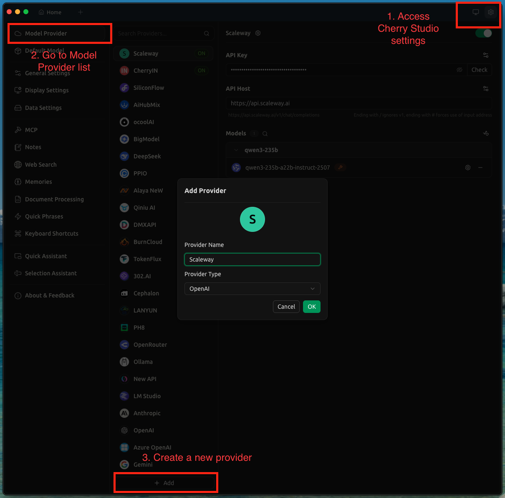
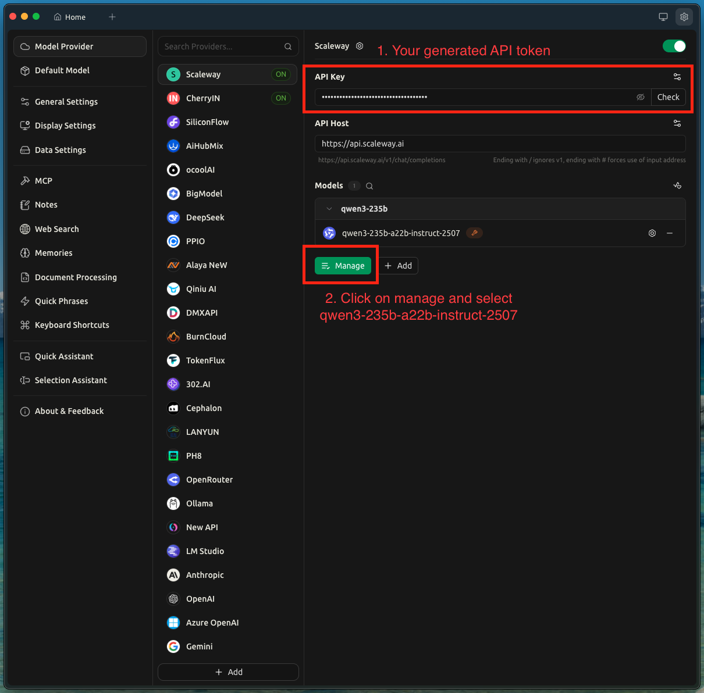
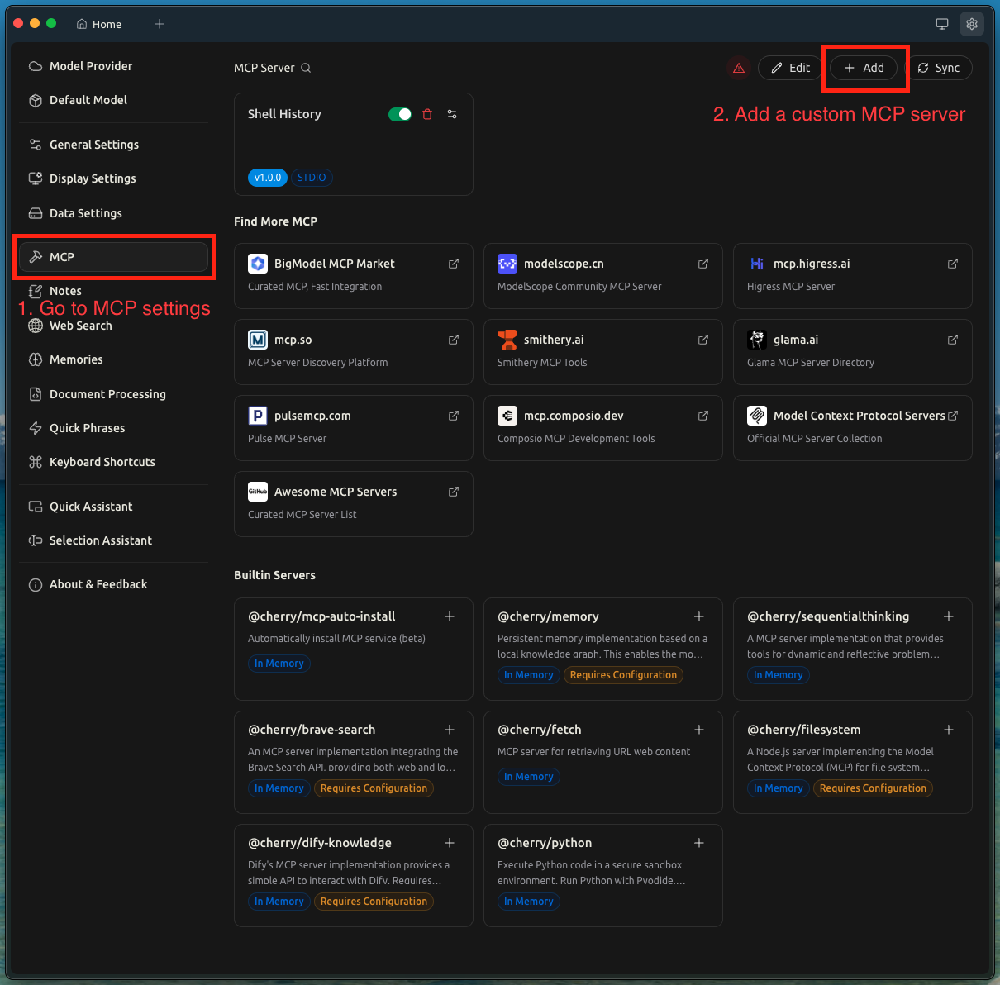
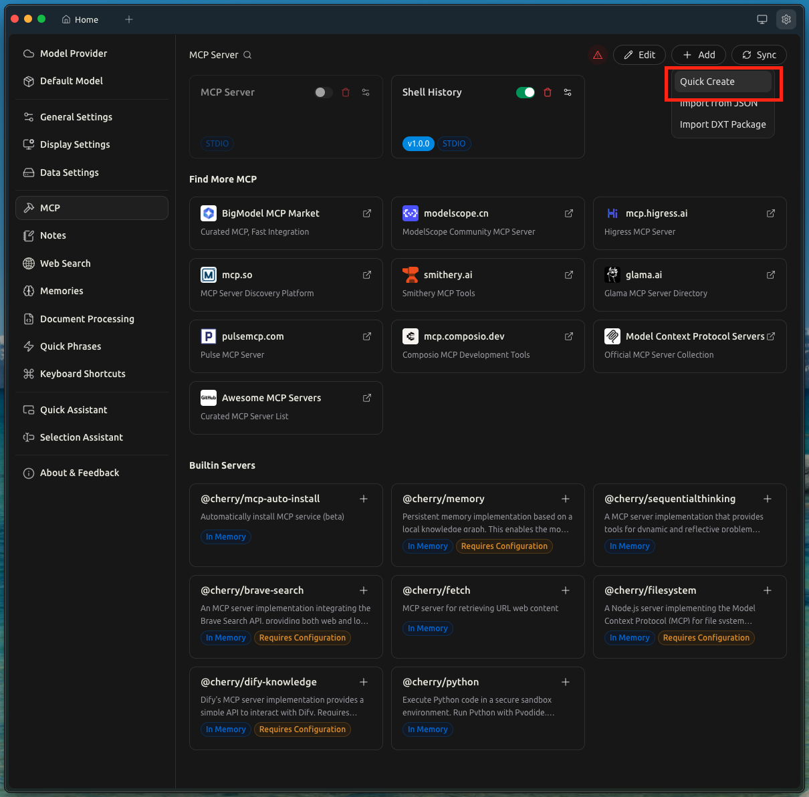
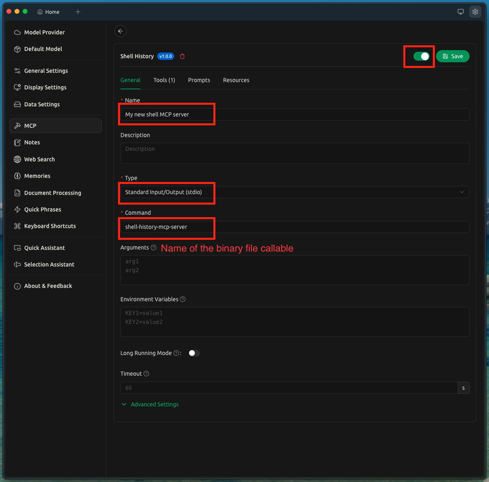
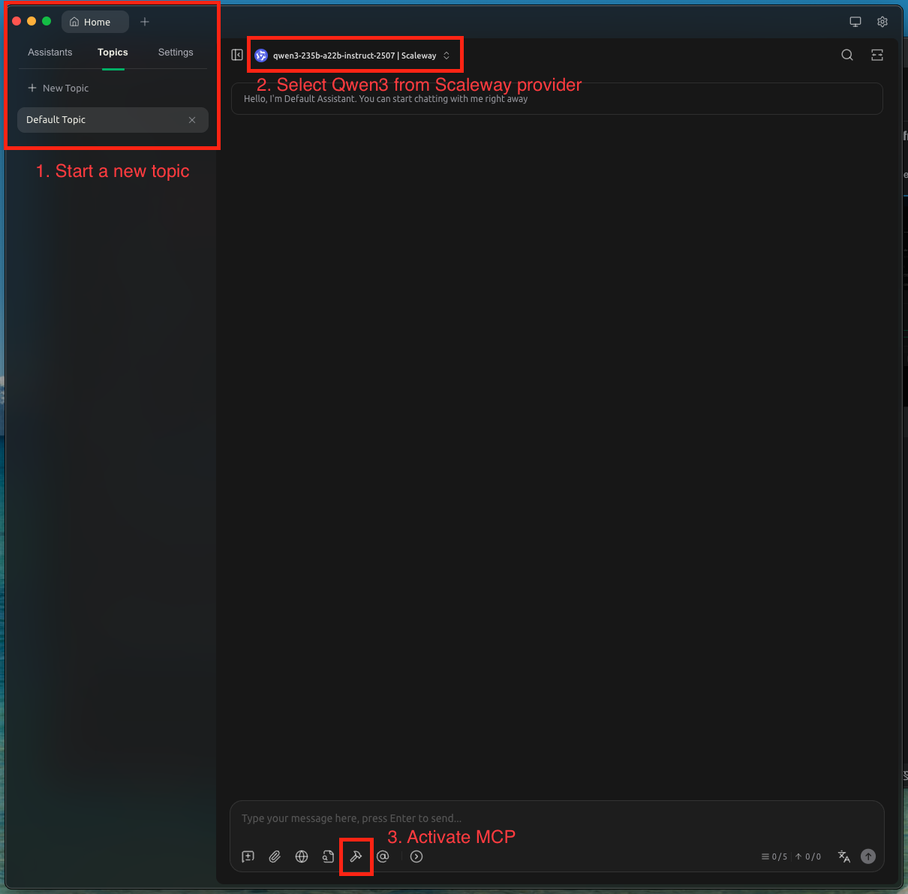

# MCP - Shell History Server

__⚠️ Disclaimer: This project is only for discover and demo purpose, there is no active development planned. Furthermore, it is only for personal use because it exposes entire shell history and represents a very high confidentiality and security risk.__

`shell-history-mcp-server` bridges your shell history and AI assistants using the Model Context Protocol (MCP). It reads shell commands from ZSH, then lets AI agents query them through structured function calls

Functions:
* `shell_history`: Returns shell history commands 

## Getting started

1. Clone the project 
```bash
$ git clone https://github.com/quentinchampenois/shell-history-mcp-server.git 
$ cd shell-history-mcp-server
```

2. Build the server
```bash
$ go mod tidy
$ go build -o shell-history-mcp-server
```
💡 Binary `shell-history-mcp-server` must be present in `$PATH` to be callable

🚀 MCP Server is ready to use ! But how ?  
If you try to run it directly `$ ./shell-history-mcp-server` process will run but nothing happens, and it's the expected behaviour.

## Configure client using Cherry studio and Scaleway AI provider

In this example we will use [Cherry Studio](https://github.com/CherryHQ/cherry-studio) as client and [model qwen3-235b-a22b-instruct-2507 from Scaleway provider](https://www.scaleway.com/en/docs/generative-apis/quickstart/). 

### Requirements
* Configure account on Scaleway and generate API token (~5 minutes)
* Cherry studio installed

### Configure Qwen3-235b from Scaleway on Cherry Studio

Open Cherry Studio and  configure the Scaleway provider: 





Configure the MCP server just installed:






__Start a new chat with MCP__



__🚀 Once Cherry studio let's give a try with a basic prompt, example: "Which scripts I am using ?"__

## Extra

* Source Cherry studio: https://github.com/CherryHQ/cherry-studio
* Source Scaleway AI (Generative API): https://www.scaleway.com/en/docs/generative-apis/quickstart/
* Go MCP SDK: https://github.com/modelcontextprotocol/go-sdk/tree/main